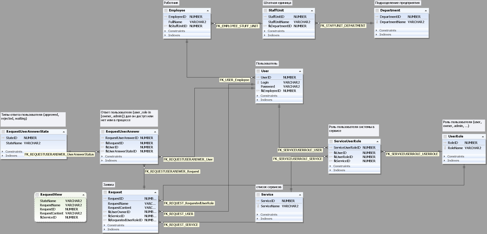

# Тестовое задание для СИТ ЮУ АЭС.

FrontEnd приложение к серверу написаному на Java/Spring

## Установка на сервер java/spring
1. Собрать командой: `ng build`
1. Копировать всё из директории `test-task-sunpp-its-frontend-angular\dist\sunpp-its-frontend\browser` в директорию `test-task-sunpp-its-backend-spring\src\main\resources\static`
